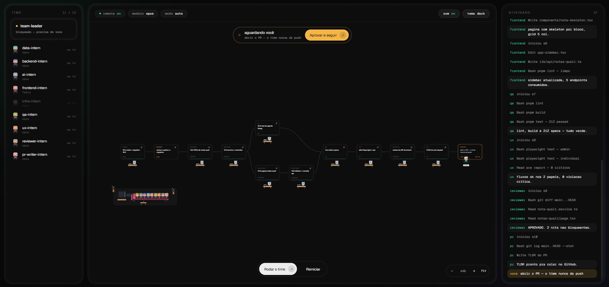

# dev-team-orchestration

Plugin de Claude Code (skill + comandos `/run` e `/run-visual`) que orquestra um **time de
subagents estagiários** para executar um **plano de implementação já escrito** no monorepo
(NestJS + Next.js + Prisma multi-tenant), camada por camada, com revisão, testes, teste de
UI/UX — e um **escritório visual ao vivo (team-view)** pra assistir o time trabalhando.



> **Skill ou plugin?** O coração é a **skill** `dev-team-orchestration`, que continua
> **autocontida**: os prompts dos estagiários vivem em `references/agents/*.md` e podem ser
> despachados via `Agent` genérico (modo skill-avulsa). O plugin adiciona por cima: os
> **subagents nomeados** em `agents/` (mesmos prompts, com identidade própria — é o que liga o
> team-view), os **hooks** de telemetria, o **viewer** e os slash commands
> `/dev-team-orchestration:run` e `/dev-team-orchestration:run-visual`.
> Instalar só a skill (Opção B) mantém o time funcionando — perde os comandos e o modo visual.

A sessão principal do Claude Code vira **Team Leader** e despacha, na ordem
`infra → dados → backend → ai → frontend`, um estagiário por camada — com um **reviewer** entre
cada camada, **QA** (lint/test/build), **ux** (Playwright + acessibilidade) e um **pr-writer**
que gera o TLDR do PR. Tudo com commit local, **sem push** e **sem aplicar migration**. A camada
**ai** (`ai-intern`) só entra quando o plano tem agentes de IA — construídos com o **Strands
Agents SDK (TS)** sobre Bedrock, seguindo as premissas do Strands e do `claude-code-guide`.

## Instalação

### Opção A — marketplace de plugin (skill + comando `/run`)

No Claude Code:

```
/plugin marketplace add brenokern/dev-team-orchestration
/plugin install dev-team-orchestration@breno
```

- `brenokern/dev-team-orchestration` é este repositório no GitHub.
- `breno` é o nome do marketplace (campo `name` em `.claude-plugin/marketplace.json`).
- Atualizar depois de mudanças: `/plugin marketplace update breno`.
- Repo privado? Adicione por caminho local: `/plugin marketplace add ~/Desktop/dev-team-orchestration`.

### Opção B — CLI de skills (instala só a skill)

Usa o CLI da comunidade `skills` (o mesmo `npx skills add ...` que outras skills usam pra
instalar a partir de um repo):

```
npx skills add https://github.com/brenokern/dev-team-orchestration --skill dev-team-orchestration --agent claude-code
```

Baixa `skills/dev-team-orchestration/SKILL.md` (+ `references/`) para o seu `.claude/skills`.
Requer o repo acessível (público, ou git autenticado se privado). Você não terá o comando
`/dev-team-orchestration:run` (ele é do plugin), mas a skill dispara por linguagem natural — ver
"Como usar".

## Como usar

Numa branch de trabalho (qualquer nome, exceto `main`/`develop`/`staging`), com um plano de
implementação já escrito:

```
/dev-team-orchestration:run caminho/do/plano.md
```

ou em linguagem natural: "roda o time nesse plano: `caminho/do/plano.md`". O Leader confirma
branch + plano e conduz o fluxo até entregar a feature com commits locais e o TLDR do PR pronto
pra você abrir.

> **Sobre o `:run`:** o Claude Code **sempre** prefixa comando de plugin com o nome do plugin
> (`/plugin:comando`), então não dá pra ter um `/dev-team-orchestration` puro — o comando é
> `/dev-team-orchestration:run`. Se preferir, ignore o slash e use linguagem natural.

## team-view — o escritório visual ao vivo

```
/dev-team-orchestration:run-visual caminho/do/plano.md
```

Igual ao `/run`, mais uma aba do browser que abre sozinha com o **escritório do time em pixel
art**: o plan-graph vira um fluxo de cards (layout por colunas, sem sobreposição, com os passos
de **validação humana** como cards âmbar tracejados), cada estagiário é um personagem que anda
até a mesa do seu passo, senta de costas olhando o PC e trabalha; quem não entra no plano fica
triste no sofá vendo TV, e quem termina vai se juntando ao sofá. O team-leader patrulha quem
está trabalhando. A câmera segue e dá zoom no passo ativo; o painel direito é o stream de
atividade real (cada tool call dos hooks).

Como funciona por baixo (e por que é seguro):

- **Hooks → NDJSON**: `hooks/hooks.json` registra `SubagentStart/Stop`, `Pre/PostToolUse` e
  `Stop`; cada evento vira UMA linha em `~/.claude/team-view/<sessão>.ndjson` via
  `hooks/emit.mjs` — que **nunca falha e nunca bloqueia** a run (erro é engolido, exit 0).
- **CLI → SSE**: `viewer/cli.mjs` (Node 18+, zero dependências) faz tail do arquivo e serve o
  viewer em `localhost:4517`. Abrir no meio da run funciona: o estado é reconstruído do log.
- **O viewer é read-only.** Não existe botão de rodar, reiniciar nem aprovar — quem comanda a
  run é o terminal, sempre.
- **Validação humana**: quando o time chega num passo `human` (aplicar migration, abrir o PR),
  o card fica âmbar pulsando, toca um chime, o título da aba pisca e o `emit.mjs` dispara uma
  **notificação nativa do SO** — tudo apontando para o mesmo lugar: **volte ao terminal**.
  (Browser não consegue focar a janela do terminal; o aviso é o melhor honesto.)
- **Replay**: `node viewer/cli.mjs --replay ~/.claude/team-view/<sessão>.ndjson` reassiste
  qualquer run. `viewer/demo.html` é uma demo standalone com uma run simulada (abra direto no
  browser, sem servidor).

Requisitos do modo visual: Claude Code com hooks `SubagentStart`/`SubagentStop` e Node 18+.

## Skills companheiras (instale para o time render 100%)

Os estagiários reutilizam skills abertas; sem elas alguns papéis rodam degradados (mas rodam):

- **superpowers** — upstream que gera o plano (brainstorming → writing-plans).
  `github.com/obra/superpowers-marketplace` →
  `/plugin marketplace add obra/superpowers-marketplace` · `/plugin install superpowers@superpowers-marketplace`
- **ponytail** — diff mínimo / anti over-engineering (global).
  `github.com/DietrichGebert/ponytail` →
  `/plugin marketplace add DietrichGebert/ponytail` · `/plugin install ponytail@ponytail`
- **taste-skill** — taste de frontend (usada pelo `frontend-intern`).
  `github.com/Leonxlnx/taste-skill` →
  `npx skills add https://github.com/Leonxlnx/taste-skill --skill design-taste-frontend`
- **ui-ux-pro-max** — inteligência de UI/UX (frontend-intern e ux-intern).
  `github.com/nextlevelbuilder/ui-ux-pro-max-skill` →
  `/plugin marketplace add nextlevelbuilder/ui-ux-pro-max-skill` · `/plugin install ui-ux-pro-max@ui-ux-pro-max-skill`
- **code review / design critique / acessibilidade** — usadas pelo `reviewer-intern` e
  `ux-intern`. Se você tiver os pacotes **Engineering** e **Design** do Claude Code
  (`engineering:code-review`, `design:design-critique`, `design:accessibility-review`), o time
  os usa; senão, esses agentes fazem review/UX sem skill dedicada.

Para o `ux-intern`: Playwright é adicionado como devDependency do front na primeira execução, e
o teste precisa de usuário de seed por papel (ADMIN/INDIVIDUAL) — ver
`skills/dev-team-orchestration/references/agents/ux.md`.

## Ver o time trabalhando

Rode num terminal integrado do VS Code com a extensão [Pixel
Agents](https://github.com/pablodelucca/pixel-agents): cada estagiário aparece como um
personagem. Detalhes em `references/pixel-agents.md`.

## Manutenção

Os padrões em `references/patterns/*` são um snapshot do código do projeto. Depois de mudanças
grandes, peça "atualiza os padrões da dev-team-orchestration" (rotina em `references/REFRESH.md`).

## Estrutura

```
.claude-plugin/
  marketplace.json        # catálogo (1 plugin, source ".")
  plugin.json             # manifesto do plugin
agents/
  *-intern.md             # 9 subagents nomeados (gerados dos references/agents + safety-and-git)
commands/
  run.md                  # /dev-team-orchestration:run
  run-visual.md           # /dev-team-orchestration:run-visual (team-view ligado)
hooks/
  hooks.json              # registra os eventos de telemetria do team-view
  emit.mjs                # única porta de escrita: NDJSON + gates + toast nativo (nunca falha)
viewer/
  cli.mjs                 # server local: tail + SSE + replay (Node 18+, zero deps)
  index.html              # o escritório (read-only, dirigido pelos eventos)
  demo.html               # demo standalone com run simulada
docs/
  team-view.png           # screenshot do viewer
skills/
  dev-team-orchestration/
    SKILL.md              # playbook do Team Leader (skill autocontida + seção do modo visual)
    references/
      agents/*.md         # 9 prompts de estagiário — fonte dos agents/ do plugin
      patterns/*.md       # premissas derivadas do repo
      safety-and-git.md · pixel-agents.md · REFRESH.md
```

> Regenerar os `agents/` depois de editar um prompt em `references/agents/`:
> cada `agents/<papel>-intern.md` = frontmatter (name/description) + `references/agents/<papel>.md`
> + `references/safety-and-git.md`.
